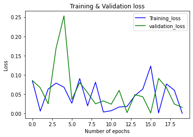
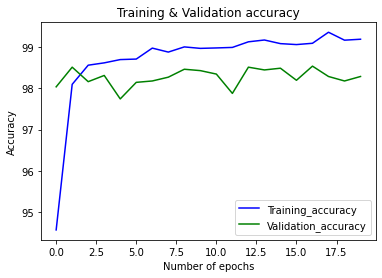

# **Week3**

In this week, the HWs of MSPL:

* MNIST手寫數字辨識 : PyTorch 

# Usage

## Environment

**``Anaconda`` + ``jupyter notebook`` (or ``VScode``).**

## Build

Get the code.

```bash
cd ~
git clone git@github.com:DanielHo-BS/MSPL.git
cd MSPL/week3
```

## Install packages
```bash
pip install -r requirements.txt
```

## Run
```bash
python3 main.py
```

# Result

## **``Training`` + ``Validation``**

### Loss



### Accuracy



## **``Testing``**

### Accuracy:  **98.4900%**
