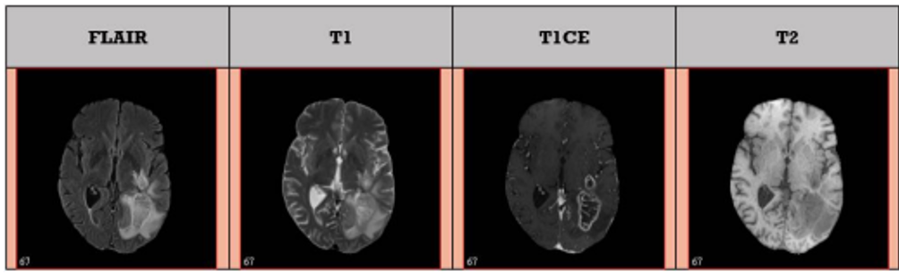
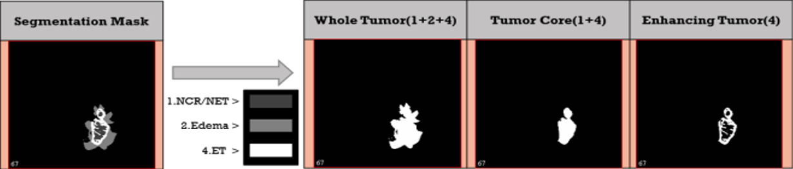
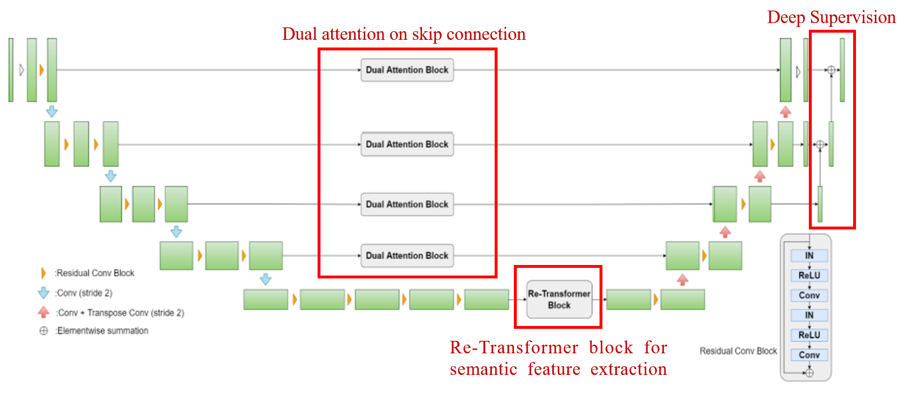
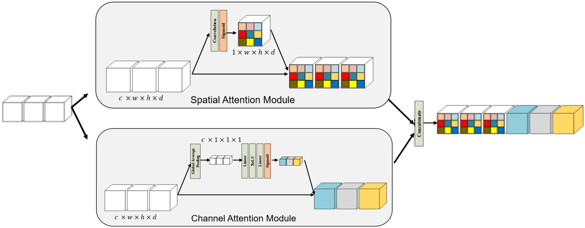
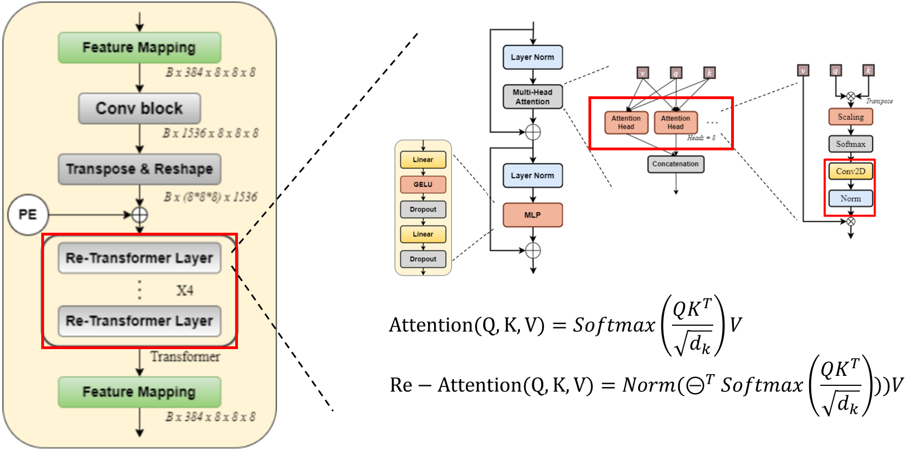
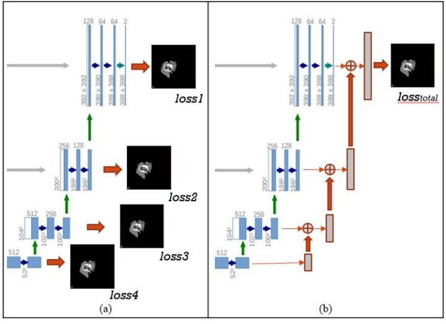
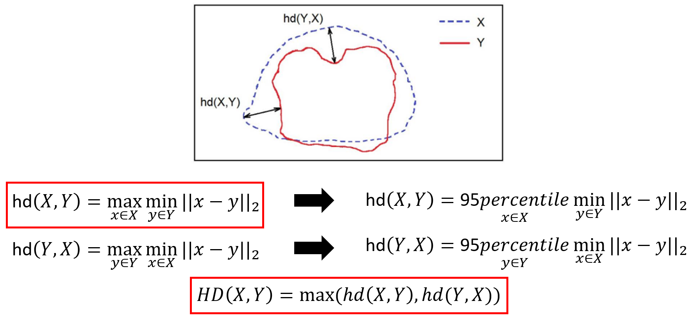
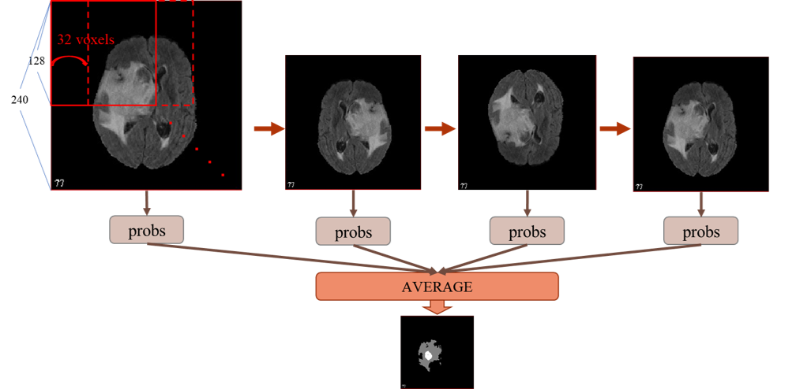
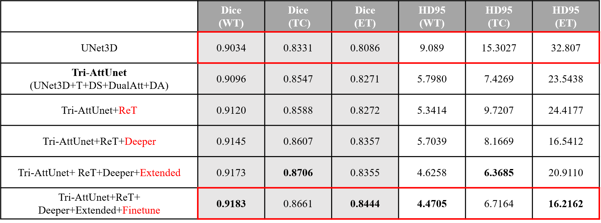
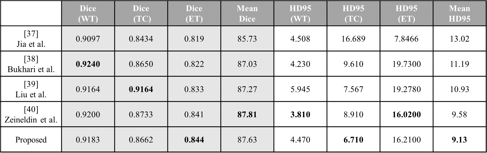

# mMRI Brain Tumor Segmentation with Extend 3D-Unet and Re-Attention Transformer

# Introdution

將MRI(大腦腫瘤)進行切割，並輸出如下:

  
  

# Model Architecture
針對`U-Net`架構，在最深層的latent feature加上了`Transformer`，作為特徵提取器加強其特徵提取的機制。  
並在skip connection上沿用本實驗室所設計的`Dual Attention`，以加強模型還原細節的能力。  
最後解碼部分使用`Deep supervision`的方式計算損失，以透明化網路內部各層
的特徵擷取能力。

## Dual Attention

## Re-Transformer

## Deep Supervision

# Data Augmentation

* Crop: 裁切
* Intensity Shift: 隨機增減像素值10%
* Flipping: 翻轉
* Rotation: 旋轉
* Elastic Deformation: 拉伸變形，模擬不同的腦腫瘤增生區域
* Motion: 模擬晃動（呼吸或是心跳）

# Evaluation

## Dice

${2*|X ∩ Y|} \over {|X|+|Y|}$

## Hausdorff Distance

# Preprocessing

## Z-score
$𝑖𝑚𝑔(𝑓𝑜𝑟𝑒𝑔𝑟𝑜𝑢𝑛𝑑) =$ ${𝑖𝑚𝑔(𝑓𝑜𝑟𝑒𝑔𝑟𝑜𝑢𝑛𝑑) − 𝑚𝑒𝑎n(img(𝑓𝑜𝑟𝑒𝑔𝑟𝑜𝑢𝑛𝑑))} \over {𝑠𝑡𝑑(𝑖𝑚𝑔(𝑓𝑜𝑟𝑒𝑔𝑟𝑜𝑢𝑛𝑑))}$

# Post-Processing

* Removing connected components smaller then 10 voxels.
* Replacing enhancing tumor smaller then 250 voxels with necrosis.

# Training Strategy

* Optimizer:
Adam with regularization of 1e-5.
* Learning rate schedule:
$initial$ ${𝐿𝑟}*{1 −𝑒𝑝𝑜𝑐ℎ \over {𝑡𝑜𝑡𝑎𝑙_{𝑒𝑝𝑜𝑐ℎ}}}^{0.9}$
* Epoch & batch size:
300 epochs and batch size of 10.
* Loss function:
$𝑆𝑜𝑓𝑡 𝐷𝑖𝑐𝑒 𝐿𝑜𝑠𝑠 =$ $2∑P_{𝑡𝑟𝑢𝑒}∑P_{𝑡𝑟𝑢𝑒} \over ∑P_{𝑡𝑟𝑢𝑒}^2 + ∑P_{𝑡𝑟𝑢𝑒}^2$
* Data augmentation on-the-fly:
  1. Random cubic crop: 128*128*128
  2. Random rotation: [−10°, 10°]
  3. Random per channel intensity: [0.9,1.1]
  4. Random mirror flip along all three axis
  5. Random clastic deformation
  6. Random Motion
* BraTS2021 dataset:
train : validation = 8 : 2 = 1000 : 251

# Inference Strategy
   

# Experimental Results

